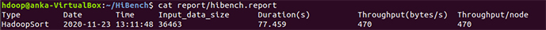

Python 3.6.9 is default version on ubuntu 18.04, but we need Python 2.7 for HiBench to work. 

Installing python 2.7 and pip for it

```
$ sudo apt install python2.7 python-pip -y
```

Installing python-pip for 3.6

```
$ sudo apt install python3-pip -y
```

You can call python pip the following way:

For python 2.7:

```
$ pip2 install <package>
```

for python 3.6:

```
$ pip install <package>
```

Running and building HiBench instructions found at [ProgrammerSought](https://www.programmersought.com/article/25911019105).

Java is requirement for maven. We make sure having Java on system

```bash
$ java -version; javac -version
    openjdk version "1.8.0_275"
    OpenJDK Runtime Environment (build 1.8.0_275-8u275-b01-0ubuntu1~18.04-b01)
    OpenJDK 64-Bit Server VM (build 25.275-b01, mixed mode)
    javac 1.8.0_275
```

## Installing Apache Maven:

Downoad the tar file:

```
$ wget https://kozyatagi.mirror.guzel.net.tr/apache/maven/maven-3/3.6.3/binaries/apache-maven-3.6.3-bin.tar.gz
```

Untar binary:

```
$ tar -zxf apache-maven-3.6.3-bin.tar.gz
```
Add environment variables:

```
$ sudo nano ~/.bashrc
```

Set maven environment

```bash
export M3_HOME=/home/hdoop/apache-maven-3.6.3
export PATH=$M3_HOME/bin:$PATH
```

Save and close the file, then update environment variables:

```
$ source ~/.bashrc
```

Verify installation by checking version:

```
$ mvn -v
    Apache Maven 3.6.3 (cecedd343002696d0abb50b32b541b8a6ba2883f)
    Maven home: /home/hdoop/apache-maven-3.6.3
    Java version: 1.8.0_275, vendor: Private Build, runtime: /usr/lib/jvm/java-8-openjdk-amd64/jre
    Default locale: en_US, platform encoding: UTF-8
    OS name: "linux", version: "5.4.0-54-generic", arch: "amd64", family: "unix"
```

## Download, Build and run HiBench  

Download HiBench 7.1 Source code (`tar.gz`) from [HiBench git releases page](https://github.com/Intel-bigdata/HiBench/releases ):

```
$ wget https://github.com/Intel-bigdata/HiBench/archive/HiBench-7.1.tar.gz
```

Untar the file:

```
$ tar -zxf HiBench-7.1.tar.gz
```

Rename the folder to a simpler name:

```
$ mv HiBench-HiBench-7.1 HiBench
```

Navigate to the extracted path:

```
$ cd HiBench
```

To build HiBench\ run the command: `mvn -Phadoopbench -Dmodules -Psql -Dscala=2.12 clean package`. During the build process it is likely to get errors. Re-running the command will eventually solve the issue.

```
$ mvn -Phadoopbench -Dmodules -Psql -Dscala=2.12 clean package
    ...
    ...
    ...
    [INFO] Reactor Summary for hibench 8.0-SNAPSHOT:
    [INFO] 
    [INFO] hibench ............................................ SUCCESS [  0.334 s]
    [INFO] hibench-common ..................................... SUCCESS [ 14.702 s]
    [INFO] HiBench data generation tools ...................... SUCCESS [ 24.114 s]
    [INFO] hadoopbench ........................................ SUCCESS [  0.044 s]
    [INFO] hadoopbench-sql .................................... SUCCESS [05:06 min]
    [INFO] sparkbench ......................................... SUCCESS [  0.057 s]
    [INFO] sparkbench-common .................................. SUCCESS [01:37 min]
    [INFO] sparkbench-sql ..................................... SUCCESS [01:13 min]
    [INFO] sparkbench project assembly ........................ SUCCESS [ 11.266 s]
    [INFO] flinkbench ......................................... SUCCESS [  0.017 s]
    [INFO] gearpumpbench ...................................... SUCCESS [  0.015 s]
    [INFO] stormbench ......................................... SUCCESS [  0.009 s]
    [INFO] ------------------------------------------------------------------------
    [INFO] BUILD SUCCESS
    [INFO] ------------------------------------------------------------------------
    [INFO] Total time:  08:48 min
    [INFO] Finished at: 2020-11-23T10:44:32+03:00
    [INFO] ------------------------------------------------------------------------
hdoop@anka-VirtualBox:~/HiBench/HiBench$
```

## Configuring HiBench

Navigate to HiBench configuration directory:

```
$ cd HiBench/conf/
$ ls -ltr
    total 40
    -rw-r--r-- 1 hdoop hadoop  942 Kas 25 01:57 storm.conf.template
    -rw-r--r-- 1 hdoop hadoop 1655 Kas 25 01:57 spark.conf.template
    -rw-r--r-- 1 hdoop hadoop 6600 Kas 25 01:57 hibench.conf
    -rw-r--r-- 1 hdoop hadoop  448 Kas 25 01:57 hadoop.conf.template
    -rw-r--r-- 1 hdoop hadoop  246 Kas 25 01:57 gearpump.conf.template
    -rw-r--r-- 1 hdoop hadoop   12 Kas 25 01:57 frameworks.lst
    -rw-r--r-- 1 hdoop hadoop  332 Kas 25 01:57 flink.conf.template
    -rw-r--r-- 1 hdoop hadoop  269 Kas 25 01:57 benchmarks.lst
    drwxr-xr-x 8 hdoop hadoop 4096 Kas 25 01:57 workloads
```

We will modify `hadoop.conf` and `hibench.conf`.  

Clone `hadoop.conf` from the provided template and open it in a text editor:

```
$ cp hadoop.conf.template hadoop.conf
$ sudo nano hadoop.conf
```

Within the text editor, set the content like following. Referring to Hadoop configuration in `etc/hadoop/core-site.xml`, `fs.default.name` property is set to port number 9000, which will be used in `hibench.hdfs.master` as shown below:

```
# Hadoop home
hibench.hadoop.home     /home/hdoop/hadoop-2.7.5

# The path of hadoop executable
hibench.hadoop.executable     ${hibench.hadoop.home}/bin/hadoop

# Hadoop configraution directory
hibench.hadoop.configure.dir  ${hibench.hadoop.home}/etc/hadoop

# The root HDFS path to store HiBench data
hibench.hdfs.master       hdfs://localhost:9000


# Hadoop release provider. Supported value: apache, cdh5, hdp
hibench.hadoop.release    apache
```

Within `hibench.conf` it is ossible to set default mapper and reducer numbers. 

```bash
$ sudo nano hibench.conf
```

```
# Data scale profile. Available value is tiny, small, large, huge, gigantic and$
# The definition of these profiles can be found in the workload's conf file i.e$
hibench.scale.profile                tiny
# Mapper number in hadoop, partition number in Spark
hibench.default.map.parallelism         8

# Reducer nubmer in hadoop, shuffle partition number in Spark
hibench.default.shuffle.parallelism     8
```

Being compiled and configured, HiBench is ready to go.  

First start HDFS and YARN:

```
$ $HADOOP_HOME/sbin/start-dfs.sh
$ $HADOOP_HOME/sbin/start-yarn.sh
```

Conducting a specific HiBench benchmark comprises to steps:
1. Preparing the data workload that is going to be leveraged, which is the file `prepare.sh`.
2. Executing the benchmark with `run.sh`

For micro benchmarks:

```
$ bin/workloads/micro/sort/prepare/prepare.sh
$ bin/workloads/micro/sort/hadoop/run.sh

$ bin/workloads/micro/terasort/prepare/prepare.sh 
$ bin/workloads/micro/terasort/hadoop/run.sh 

$ bin/workloads/micro/wordcount/prepare/prepare.sh 
$ bin/workloads/micro/wordcount/hadoop/run.sh 

$ bin/workloads/micro/dfsioe/prepare/prepare.sh 
$ bin/workloads/micro/dfsioe/hadoop/run.sh 

$ bin/workloads/micro/sleep/prepare/prepare.sh
$ bin/workloads/micro/sleep/hadoop/run.sh
```

For SQL benchmarks:

```
$ bin/workloads/sql/scan/prepare/prepare.sh
$ bin/workloads/sql/scan/hadoop/run.sh

$ bin/workloads/sql/join/prepare/prepare.sh
$ bin/workloads/sql/join/hadoop/run.sh

$ bin/workloads/sql/aggregation/prepare/prepare.sh
$ bin/workloads/sql/aggregation/hadoop/run.sh
```

For ML benchmarks:

```
$ bin/workloads/ml/bayes/prepare/prepare.sh
$ bin/workloads/ml/bayes/hadoop/run.sh

$ bin/workloads/ml/kmeans/prepare/prepare.sh
$ bin/workloads/ml/kmeans/hadoop/run.sh
```

For Websearch benchmarks:

```
$ bin/workloads/websearch/nutchindexing/prepare/prepare.sh
$ bin/workloads/websearch/nutchindexing/hadoop/run.sh
$ bin/workloads/websearch/pagerank/prepare/prepare.sh
$ bin/workloads/websearch/pagerank/hadoop/run.sh
```

## Accessing the benchmark report

The benchmark report is accessable with the following command:

```
$ HiBench/report/hibench.report
$ cat report/hibench.report 
```



The report folder also includes MaReduce execution logs generated during benchmark execution, which is a good feature especially to understand the processes.