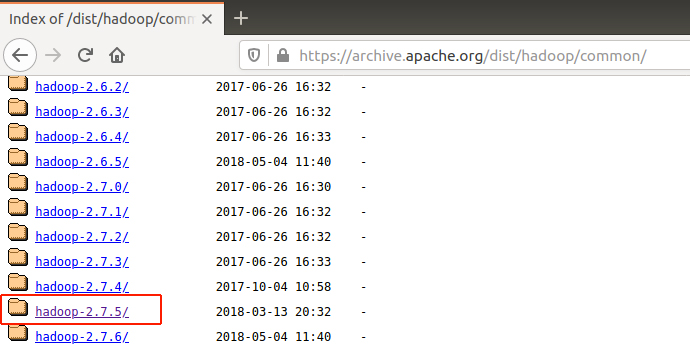
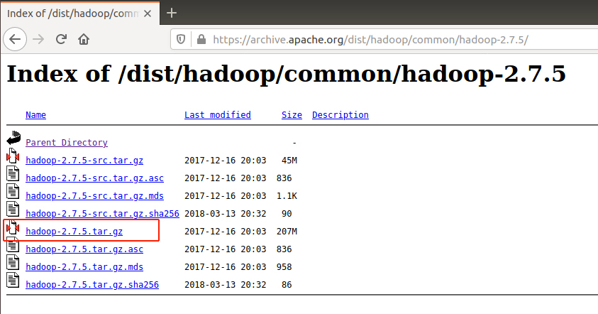
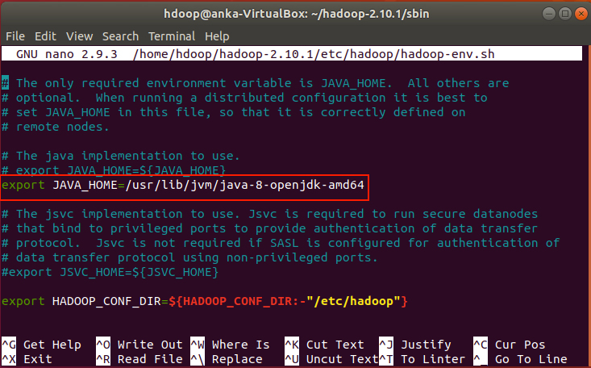
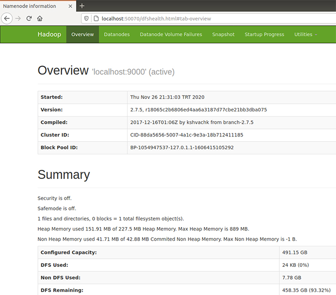
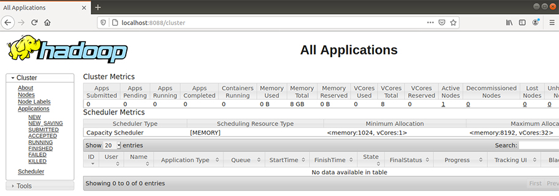

## Installing Hadoop on ubuntu18.04 (Virtualbox):  

We assume that **ubuntu 18.04** on VirtualBox is already installed. Installing ubuntu on Virtualbox is a straightforward process, after a quick internet search plenty of resources providing installation instructions can be found.  

The Hadoop version we are going to use is 2.7.5, meaning Java 8 is required. Before starting with Java installation, an update with the apt sources is necessary to make sure the repositories are up to date.  

```
$ sudo apt update 
$ sudo apt upgrade
```
### Installing JAVA
By running the command below, OpenJDK 8 will be installed:

```
$ sudo apt install openjdk-8-jdk -y
```

Checking if Java is properly installed:

```
$ java -version; javac -version
    openjdk version "1.8.0_275"
    OpenJDK Runtime Environment (build 1.8.0_275-8u275-b01-0ubuntu1~18.04-b01)
    OpenJDK 64-Bit Server VM (build 25.275-b01, mixed mode)
    javac 1.8.0_275
```

We need to specify the JAVA_HOME environment variable since it will be used by Hadoop. First, we query the Java installation path by entering the command:

```
$ sudo update-alternatives --config java
    There is only one alternative in link group java 
    (providing /usr/bin/java): /usr/lib/jvm/
    java-8-openjdk-amd64/jre/bin/java
```

The path which will be used is `/usr/lib/jvm/java-8-openjdk-amd64`. Open `etc/environment` file with a proper text editor:

```
$ sudo nano /etc/environment
```

Within the editor, we add the `JAVA_HOME` path as the latest line:

```
JAVA_HOME=/usr/lib/jvm/java-8-openjdk-amd64
```

Save and close the file, then source it with following command:

```
$ source /etc/environment
```

Verifying the java installation path:

```
$ echo $JAVA_HOME
    /usr/lib/jvm/java-8-openjdk-amd64
```

### Paswordless SSH 

Hadoop consists of separate nodes communicating with each other. For a secure intercommunication among each other, we need to install openSSH, and prepare a passwordless environment to lift the password entrance obligation.  

Firstly, install openssh server and openssh client by following command:

```
$ sudo apt install openssh-server openssh-client -y
```

Now create a Hadoop group:

```
$ sudo addgroup hadoop
```

Create a user (`hdoop`) for running Hadoop operations, and add it to the group Hadoop: 

```
$ sudo adduser --ingroup hadoop hdoop
```

A password for the user is required, we can leave other fields blank. Then we add the user `hdoop` to the sudoers iıst. This step is necessary for uninterrupted intercommunicating with other nodes.

```
$ sudo adduser hdoop sudo
```

Having set the user, we now enable passwordless SSH for the user. First we switch to the dedicated user by entering following command:  

```
$ su – hdoop
```

We first generate an SSH key pair:

```
$ ssh-keygen -t rsa -P '' -f ~/.ssh/id_rsa
    Generating public/private rsa key pair.
    Created directory '/home/hdoop/.ssh'.
    Your identification has been saved in /home/hdoop/.ssh/id_rsa.
    Your public key has been saved in /home/hdoop/.ssh/id_rsa.pub.
    The key fingerprint is:
    SHA256:3iAo398rLlXyrajTqJmowWUAnUlxCgcMUz/qgNZ0UlY hdoop@anka-VirtualBox
    The key's randomart image is:
    +---[RSA 2048]----+
    |O==+.o.E         |
    |.=++o            |
    | ..oo.           |
    |. +.oo  . .      |
    |o.o+. . S+ .     |
    |oooo . o.o. .    |
    |... . .+....     |
    | . . o+.+..      |
    |... +..=o.o.     |
    +----[SHA256]-----+
```

Running following command will store the generated key as authorized_keys in the ssh directory:

```
$ cat ~/.ssh/id_rsa.pub >> ~/.ssh/authorized_keys
```

Setting permissions for the user:

```
$ chmod 0600 ~/.ssh/authorized_keys
```

It is good practise to confirm paswordless ssh is working properly. To do so, we shortly connect to ssh on localhost as the user `hdoop`.

```
$ ssh localhost
    The authenticity of host 'localhost (127.0.0.1)' can't be established.
    ECDSA key fingerprint is SHA256:IA5LMFBK+JyN0/7t7IBC2k0OWRP0iaAJ+TkmIkBXCO0.
    Are you sure you want to continue connecting (yes/no)? yes
    Warning: Permanently added 'localhost' (ECDSA) to the list of known hosts.
    Welcome to Ubuntu 18.04.5 LTS (GNU/Linux 5.4.0-54-generic x86_64)
```

Getting such a response as above means everything is working fine. We then can exit from localhost:

```
$ exit
    logout
    Connection to localhost closed.
    Hadoop Installation 2.7.5
```

### Download and Install Hadoop  

HiBench 7.1 supports Hadoop version 2.x. We are going to install Apache Hadoop 2.7.5 on the ubuntu VM.  

To install Hadoop, we first download and extract Hadoop installation files. Afterwards an editing a set of configuration files is necessary:  

    • bashrc  
    • hadoop-env.sh  
    • core-site.xml  
    • hdfs-site.xml  
    • mapred-site-xml  
    • yarn-site.xml  

Before proceeding make sure that the operating user is the dedicated Hadoop user (`hdoop`) created in previoes steps.  

From the webpage of [Apache Hadoop releases](http://archive.apache.org/dist/hadoop/common/) we point the version (2.7.5):



Navigating to the directory will give related download links for the release. Copy link location for hadoop-2.7.5.tar.gz to use in the next step (https://archive.apache.org/dist/hadoop/common/hadoop-2.7.5/hadoop-2.7.5.tar.gz)



Download the binary to the local OS.

```
$ wget https://archive.apache.org/dist/hadoop/common/hadoop-2.7.5/hadoop-2.7.5.tar.gz 
```

Next, tar the file to start the installation:

```
$ tar -xzf hadoop-2.7.5.tar.gz
```

Editing the .bashrc file: 

```
$ sudo nano ~/.bashrc
```

Hadoop environment variables are added to the end of the `bashrc` file

```bash
#Hadoop Related Options
export HADOOP_HOME=/home/hdoop/hadoop-2.7.5
export HADOOP_INSTALL=$HADOOP_HOME
export HADOOP_MAPRED_HOME=$HADOOP_HOME
export HADOOP_COMMON_HOME=$HADOOP_HOME
export HADOOP_HDFS_HOME=$HADOOP_HOME
export YARN_HOME=$HADOOP_HOME
export HADOOP_COMMON_LIB_NATIVE_DIR=$HADOOP_HOME/lib/native
export PATH=$PATH:$HADOOP_HOME/sbin:$HADOOP_HOME/bin
export HADOOP_OPTS="-Djava.library.path=$HADOOP_HOME/lib/native"
```

To apply changes, save and exit the file, then source it with following command:

```
$ source ~/.bashrc
```

**Editing `hadoop-env.sh` file:**  
`hadoop-env.sh` is the master file for configuring HDFS, YARN, MapReduce, and Hadoop related project settings. Running following command will open the configuration file in nano editor:

```
$ sudo nano $HADOOP_HOME/etc/hadoop/hadoop-env.sh
```

Within the file we specify the JAVA_PATH installed at the beginning: `/usr/lib/jvm/java-8-openjdk-amd64`. 



**Configuring core-site.xml:**  
`core-site.xml` keeps the properties for HDFS and Hadoop. Open the file with nano editor:

```
$ sudo nano $HADOOP_HOME/etc/hadoop/core-site.xml
```

Put following content to the file, then save and close it.

```XML
<configuration>
<property>
  <name>hadoop.tmp.dir</name>
  <value>/home/hdoop/tmpdata</value>
</property>
<property>
  <name>fs.default.name</name>
  <value>hdfs://127.0.0.1:9000</value>
</property>
</configuration>
```

Create the temporary folder specified in core-site.xml:  

```
$ mkdir -m777 tmpdata
```

**Configuring `hdfs-site.xml`:**  
This file stores information like NameNode and DataNode storage directories, replication factor of Hadoop, etc.

```
$ sudo nano $HADOOP_HOME/etc/hadoop/hdfs-site.xml
```

Setting properties for NameNode and DataNode storage, replication factor, and file permissions. Save and close the xml.

```XML
<configuration>
<property>
  <name>dfs.data.dir</name>
  <value>/home/hdoop/dfsdata/namenode</value>
</property>
<property>
  <name>dfs.data.dir</name>
  <value>/home/hdoop/dfsdata/datanode</value>
</property>
<property>
  <name>dfs.replication</name>
  <value>1</value>
</property>
<property>
  <name>dfs.permissions</name>
  <value>false</value>
</property>
</configuration>
```

In the configuration file, namenode and datanode paths are specified, now create those paths:

```
$ mkdir -p dfsdata/namenode	
$ mkdir dfsdata/datanode
```

**Editing `mapred-site.xml`:**  
This file file keeps MapReduce specific settings. First clone the `mapred-site.xml.template` file as configuration file:

```
$ cp $HADOOP_HOME/etc/hadoop/mapred-site.xml.template $HADOOP_HOME/etc/hadoop/mapred-site.xml
```

Open the configuration file in editor:

```
$ sudo nano $HADOOP_HOME/etc/hadoop/mapred-site.xml
```

Hadoop’s MapReduce framework has two versions: MRv1 and MRv2 (YARN). YARN is specified in this configuration file as property. Place following configuration settings to the file to do so, save, and close the file:

```XML
<configuration>
<property>
  <name>mapreduce.framework.name</name>
  <value>yarn</value>
</property>
</configuration>
```

**Editing `yarn-site.xml`:**  
Specifying YARN as the MapReduce framework is not enough, also awaits to specified YARN specific properties which is defined in the yarn-site.xml configuration file. First open it with a text editor:

```
$ sudo nano $HADOOP_HOME/etc/hadoop/yarn-site.xml
```

Place following properties into the file, save and exit:  

```XML
<configuration>
<property>
  <name>yarn.nodemanager.aux-services</name>
  <value>mapreduce_shuffle</value>
</property>
<property>
  <name>yarn.nodemanager.aux-services.mapreduce.shuffle.class</name>
  <value>org.apache.hadoop.mapred.ShuffleHandler</value>
</property>
<property>
  <name>yarn.resourcemanager.hostname</name>
  <value>127.0.0.1</value>
</property>
<property>
  <name>yarn.acl.enable</name>
  <value>0</value>
</property>
<property>
  <name>yarn.nodemanager.vmem-check-enabled</name>
  <value>false</value>
</property> 
<property>
  <name>yarn.nodemanager.env-whitelist</name>
      <value>JAVA_HOME,HADOOP_COMMON_HOME,HADOOP_HDFS_HOME,HADOOP_CONF_DIR,CLASSPATH_PERPEND_DISTCACHE,HADOOP_YARN_HOME,HADOOP_MAPRED_HOME</value>
</property>
</configuration>
```

Hadoop core installation is completed. Before running Hadoop, it is necessary to format the filesystem:

```
$ hdfs namenode -format
```

Hadoop operating scripts are located in `hadoop-2.10.1/sbin` directory. By navigating there and running following scripts, Hadoop gets started:

```
$ cd hadoop-2.7.5/sbin
```

```
$ start-dfs.sh
    Starting namenodes on [localhost]
    localhost: starting namenode, logging to /home/hdoop/hadoop-2.7.5/logs/hadoop-hdoop-namenode-anka-VirtualBox.out
    localhost: starting datanode, logging to /home/hdoop/hadoop-2.7.5/logs/hadoop-hdoop-datanode-anka-VirtualBox.out
    Starting secondary namenodes [0.0.0.0]
    0.0.0.0: starting secondarynamenode, logging to /home/hdoop/hadoop-2.7.5/logs/hadoop-hdoop-secondarynamenode-anka-VirtualBox.out
```

```
$ start-yarn.sh
    starting yarn daemons
    starting resourcemanager, logging to /home/hdoop/hadoop-2.7.5/logs/yarn-hdoop-resourcemanager-anka-VirtualBox.out
    localhost: starting nodemanager, logging to /home/hdoop/hadoop-2.7.5/logs/yarn-hdoop-nodemanager-anka-VirtualBox.out
```

Verifying running services will list the running HDFS and YARN daemons:

```
$ jps
    11345 NodeManager
    11028 SecondaryNameNode
    11188 ResourceManager
    10807 DataNode
    11674 Jps
    10622 NameNode
```

Hadoop is up and running. We can acces Hadoop web UI from the browser by entering localhost and relevant port numbers:
`localhost:50070` for NameNode Manager



`localhost:8088` for YARN Resource Manager


